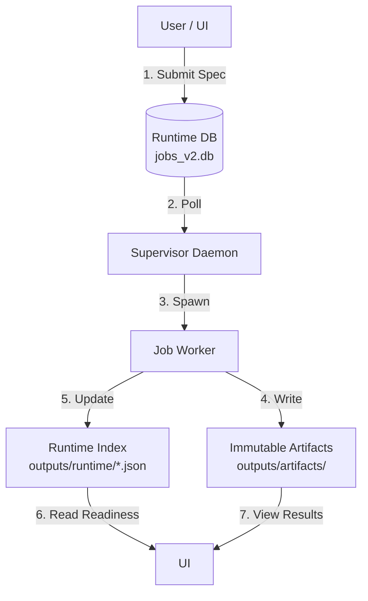

# System Architecture: Single Source of Truth (SSOT) Flow

This document defines the **Single Source of Truth (SSOT)** for every component in the FishBroWFS_V2 system. It serves as the primary reference for Code Review to ensure all changes respect the flow of data and authority.

## 1. The Core Philosophy
**"State is explicit. Derivatives are traceable. UI is a projection."**

Nothing exists "just in memory". If the system restarts, the State must be recoverable from the Disk (DB + Artifacts).

---

## 2. Configuration SSOT
*   **Truth Location**: `configs/` (YAML files)
*   **Code Access**: `src/config/registry/` (Strict Typed Loaders)
*   **Validation**: Pydantic Models in `src/contracts/`

| Component | Config File | Loader | Constraints |
|-----------|-------------|--------|-------------|
| **Instruments** | `configs/portfolio/instruments.yaml` | `load_instruments()` | Unique IDs, Timezones |
| **Datasets** | `configs/data/datasets.yaml` | `load_datasets()` | Valid Sources, Timeframes |
| **Strategies** | `configs/strategy/catalog.yaml` | `StrategyCatalog` | Registered Class Names |

**Rule**: Code NEVER hardcodes configuration (e.g., "CME.ES"). It queries the Registry.

---

## 3. Feature Universe (Deterministic Scope)
The feature universe is read-only and deterministic.

### Canonical Window Sets
*   **General**: `[5, 10, 20, 40, 80, 160, 252]`
*   **Stats**: `[63, 126, 252]`

### Feature Families (G1-G10)
*   **G1-G5**: Core indicators (MA, EMA, RSI, etc.).
*   **G6**: Structural (`daily_pivot`, `swing_high/low`).
*   **G7-G8**: Volatility and Momentum.
*   **G9-G10**: Volume and Correlation (Placeholders).

---

## 4. Job Lifecycle SSOT
*   **Truth Location**: `outputs/runtime/jobs_v2.db` (SQLite)
*   **Authority**: `SupervisorDB` Class
*   **States**: `QUEUED` -> `RUNNING` -> `SUCCEEDED` / `FAILED`

### The Flow
1.  **Intent**: UI constructs a `JobSpec` (JSON) and calls `db.submit_job()`.
2.  **Assignment**: Supervisor locks a row (`RUNNING`) and assigns a `worker_id`.
3.  **Execution**: Worker runs in a separate process. It **MUST** update Heartbeats in DB.
4.  **Completion**: Worker writes results to `outputs/artifacts/jobs/{id}/` and updates DB state to `SUCCEEDED`.

**Rule**: The UI never communicates with the Worker directly. The DB is the **only** bridge.

---

## 4. Data & Artifact SSOT
### 4.1 Job Artifacts (System Receipts)
*   **Truth Location**: `outputs/artifacts/jobs/{job_id}/` (Immutable)
*   **Manifest**: Every job **MUST** produce a receipt manifest.
    *   Canonical name: `{job_type}_manifest.json` (e.g., `build_data_manifest.json`).
    *   Legacy handlers may still emit `manifest.json`.
*   **Logs**: `stdout.txt` / `stderr.txt`.
*   **Result**: `results.json` (structured output data).

### 5.2 Domain Artifacts (Shared Data & Results)
*   **Truth Location**: `outputs/shared/{season}/{dataset_id}/` OR `outputs/artifacts/seasons/...`
*   **Manifests**:
    *   `shared_manifest.json`: Dataset-level summary.
    *   `bars_manifest.json`: Bars inventory.
    *   `features_manifest.json`: Features inventory.
    *   `manifest.json`: Domain manifest for research runs.
*   **Payloads**: `bars/`, `features/`, `results/`.

**Rule**: If a file is not listed in the manifest, it does not officially exist.

---

## 5. Data Readiness SSOT (The "Runtime Index")
*   **Problem**: The UI needs to know "Is the data for 2026Q1 ready?" without scanning 10,000 folders.
*   **Truth Location**: `outputs/runtime/bar_prepare_index.json`
*   **Mechanism**:
    *   **Generator**: `src/control/runtime_index.py`
    *   **Trigger**: Runs automatically after any `BUILD_DATA` job succeeds.
    *   **Content**: A compact index of `{instrument: {timeframe: path}}`.
*   **Consumer**: TUI gating (e.g., disable actions if runtime index missing).

**Rule**: The UI checks the Index, not the raw file system, for permission logic.

---

## 6. Code Review Checklist
When reviewing changes, verify:

1.  [ ] **No Hidden State**: Does the feature rely on Python global variables? (Reject. Use DB/Artifacts).
2.  [ ] **Path Hygiene**: Does it use `core.paths`? (Reject hardcoded strings like `"./outputs"`).
3.  [ ] **Manifest Discipline**: Does the new Job produce a Manifest?
4.  [ ] **Unidirectional Flow**: Does Data flow `Config -> Job -> Artifact`? (Reject cycles).
