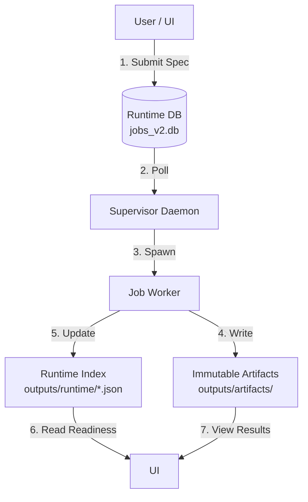

# System Architecture: Single Source of Truth (SSOT) Flow

Status: **SSOT overview** (high-level).  
Execution semantics, costs, FX, WFS policy, and `result.json` structure are specified in:
- `docs/SPEC_ENGINE_V1.md`

This document defines the **authority map** (where truth lives) and the **non-negotiable data flow**.

## 1. The Core Philosophy
**"State is explicit. Derivatives are traceable. UI is a projection."**

Nothing exists "just in memory". If the system restarts, the State must be recoverable from the Disk (DB + Artifacts).

---

## 2. Configuration SSOT
*   **Truth Location**: `configs/` (YAML files)
*   **Validation**: `src/contracts/` (Pydantic / typed models + fail-closed guards)

| Component | Config File | Loader | Constraints |
|-----------|-------------|--------|-------------|
| **Instruments** | `configs/registry/instruments.yaml` | `contracts.dimensions_loader` + TUI bridge | Unique IDs, default_profile links, tick specs, roll rules, **cost_model** |
| **FX** | `configs/registry/fx.yaml` | readers (base-currency conversion) | Fixed constants in V1 |
| **Strategies** | `configs/registry/strategies.yaml` | TUI bridge + resolver | Strategy metadata + config file links |
| **WFS Policy** | `configs/policies/wfs/policy_v1_default.yaml` | `contracts.wfs_policy` | gates + grading |

**Rule**: Code NEVER hardcodes configuration (e.g., "CME.ES"). It queries the Registry.

---

## 3. Specs and Determinism
Specs are written first, then implemented.

- **Execution SSOT**: `docs/SPEC_ENGINE_V1.md`
- **Result schema SSOT**: `src/contracts/research_wfs/result_schema.py` (versioned)
- **Determinism rule**: given the same inputs + configs, outputs must be identical (no hidden state).

---

## 4. Job Lifecycle SSOT
*   **Truth Location**: `outputs/runtime/jobs_v2.db` (SQLite)
*   **Authority**: `SupervisorDB` Class
*   **States**: `QUEUED` -> `RUNNING` -> `SUCCEEDED` / `FAILED`

### The Flow
1.  **Intent**: UI constructs job params and calls `control.supervisor.submit(job_type, params)` (preflight + policies intact).
2.  **Assignment**: Supervisor locks a row (`RUNNING`) and assigns a `worker_id`.
3.  **Execution**: Worker runs in a separate process. It **MUST** update Heartbeats in DB.
4.  **Completion**: Worker writes results to `outputs/artifacts/jobs/{id}/` and updates DB state to `SUCCEEDED`.

**Rule**: The UI never communicates with the Worker directly. The DB is the **only** bridge.

---

## 5. Data & Artifact SSOT
### 4.1 Job Artifacts (System Receipts)
*   **Truth Location**: `outputs/artifacts/jobs/{job_id}/` (Immutable)
*   **Manifest**: Every job **MUST** produce a receipt manifest.
    *   Canonical name: `{job_type}_manifest.json` (e.g., `build_data_manifest.json`).
    *   Legacy handlers may still emit `manifest.json`.
*   **Logs**: `stdout.txt` / `stderr.txt`.
*   **Result**: `result.json` (structured output data; versioned schema in `src/contracts/...`).

### 5.2 Domain Artifacts (Shared Data & Results)
*   **Truth Location**: `cache/shared/{season}/{dataset_id}/` OR `outputs/artifacts/seasons/...`
*   **Manifests**:
    *   `shared_manifest.json`: Dataset-level summary.
    *   `bars_manifest.json`: Bars inventory.
    *   `features_manifest.json`: Features inventory.
    *   `manifest.json`: Domain manifest for research runs.
*   **Payloads**: `bars/`, `features/`, `results/`.

**Rule**: If a file is not listed in the manifest, it does not officially exist.

---

## 6. Data Readiness SSOT (The "Runtime Index")
*   **Problem**: The UI needs to know "Is the data for 2026Q1 ready?" without scanning 10,000 folders.
*   **Truth Location**: `outputs/runtime/bar_prepare_index.json`
*   **Mechanism**:
    *   **Generator**: `src/control/runtime_index.py`
    *   **Trigger**: Runs automatically after any data-prep job succeeds (`BUILD_BARS` / `BUILD_FEATURES` / legacy `BUILD_DATA`).
    *   **Content**: A compact index of `{instrument: {timeframe: path}}`.
*   **Consumer**: TUI gating (e.g., disable actions if runtime index missing).

**Rule**: The UI checks the Index, not the raw file system, for permission logic.

---

## 7. Code Review Checklist
When reviewing changes, verify:

1.  [ ] **No Hidden State**: Does the feature rely on Python global variables? (Reject. Use DB/Artifacts).
2.  [ ] **Path Hygiene**: Does it use `core.paths`? (Reject hardcoded strings like `"./outputs"`).
3.  [ ] **Manifest Discipline**: Does the new Job produce a Manifest?
4.  [ ] **Unidirectional Flow**: Does Data flow `Config -> Job -> Artifact`? (Reject cycles).
