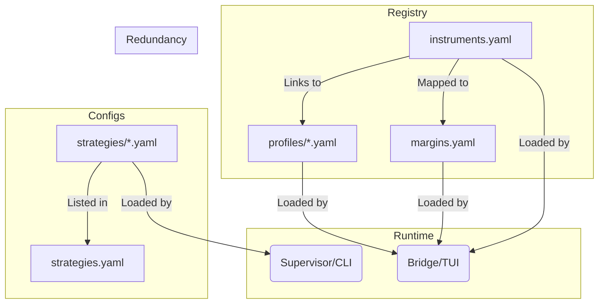

# Configuration System Documentation

Status: **Guide** (must stay consistent with SSOT).  
If anything here conflicts with SSOT, prefer:
- `docs/SPEC_ENGINE_V1.md`
- `docs/_archive/ARCHITECTURE_SSOT.md`

Overview of the `configs/` directory. This system separates:
- **Definitions (Registry)** — what an instrument/strategy *is*
- **Runtime Behavior (Profiles)** — session windows + timezones + memory knobs
- **Governance (Policies)** — what is admissible/tradable

## 1. Registry (`configs/registry/`)
*The "Source of Truth" for system entities.*

| File | Purpose | Used By | Workflow |
| :--- | :--- | :--- | :--- |
| **`instruments.yaml`** | **Master Instrument List (SSOT)**. Defines ID, exchange, tick specs, roll rules, and **cost_model**. | TUI + runtime loaders | **TUI**: Display instrument specs + cost model. |
| **`margins.yaml`** | **Margin Logic**. Defines margin profiles and maps them to instruments. | `gui.tui.services.bridge.Bridge.get_instrument_details` | **TUI**: Displaying capital requirements (initial/maintenance margins). |
| **`strategies.yaml`** | **Strategy Registry**. Lists strategy IDs and references to config files. | `gui.tui.services.bridge.Bridge.get_strategy_catalog` | **TUI**: Populating the strategy selection list; config audit / readiness checks. |
| **`timeframes.yaml`** | **Timeframe Registry**. Lists supported timeframes and display names. | *(Currently not wired into TUI mainline)* | **Reference**: Canonical list of timeframes. |
| **`dataset_id` convention** | **Mainline Simplification**. Treat `dataset_id == instrument_id` (e.g., `CME.MNQ`). | Used across job params and paths | **Note**: A separate `datasets.yaml` registry is removed in this mainline to reduce duplication. |
| **`fx.yaml`** | **FX Registry (SSOT)**. Fixed FX constants used to convert to base currency (V1: TWD). | PnL/scoring/reporting | V1 uses constants only (no time-series FX). |

## 2. Profiles (`configs/profiles/`)
*Runtime execution context for instruments. Defines “when and how this instrument trades”.*

| File Pattern | Purpose | Used By | Workflow |
| :--- | :--- | :--- | :--- |
| **`{PROFILE_ID}.yaml`** | **Trading Profile**. Defines session windows and timezone context + memory knobs. | TUI + time/window logic | Used as the default profile linked from `instruments.yaml`. |

*   **Key Insight**: An instrument in `registry/instruments.yaml` links to a specific profile here (e.g., `default_profile: CME_MNQ_TPE_v1`). This allows switching logic (e.g., "TPE Fixed" vs "Native 24h") without changing the instrument definition.

**SSOT Rule (V1)**:
- Trading costs live in `configs/registry/instruments.yaml` under `cost_model`.
- Profiles must **not** define `cost_model`.

## 3. Strategies (`configs/strategies/`)
*Logic and parameters for specific algorithmic strategies.*

| File | Purpose | Used By | Workflow |
| :--- | :--- | :--- | :--- |
| **`{strategy_id}.yaml`** | **Strategy Config**. Strategy parameters and feature requirements (YAML). | `gui.tui.services.bridge.Bridge.get_strategy_readiness` `control.resolve_cli` `control.supervisor.handlers.run_research_wfs._load_strategy_defaults` | **Research**: WFS reads defaults best-effort from YAML (mainline fallback if missing). **CLI**: Resolve features requirements from YAML. |

## 4. Portfolio (`configs/portfolio/`)
*Basket composition and selection logic.*

| File | Purpose | Used By | Workflow |
| :--- | :--- | :--- | :--- |
| **`portfolio_spec_v1.yaml`** | **Default Portfolio Spec**. Basket definition / constraints. | `gui.tui.services.bridge.Bridge.get_instruments` (reads instrument_ids allowlist) | **TUI**: portfolio allowlist and selection views. |
| **`governance.yaml`** | **Portfolio Governance Rules**. Business rules / limits for portfolio admission. | *(Not wired in mainline yet)* | **Mainline note**: reserved for portfolio admission rules. |

## 5. Policies (`configs/policies/`)
*Governance policies centralized outside strategy configs.*

| File Pattern | Purpose | Used By | Workflow |
| :--- | :--- | :--- | :--- |
| **`wfs/*.yaml`** | **WFS Governance Policies**. Gates and scoring rules for WFS pass/fail + scoring. | `control.supervisor.handlers.run_research_wfs` (policy selection) | **Pipeline**: deciding if a research run is admissible / tradable. |

## 6. Templates (`configs/templates/`)
*Boilerplate for creation.*

| File | Purpose | Used By | Workflow |
| :--- | :--- | :--- | :--- |
| **`research_mainline.yaml`** | **Scaffolding**. Base template for creating new Strategy YAMLs. | `Manual Dev` | **Development**: Copy-paste to start a new strategy. |

---

## Data Flow Diagram

## Mainline Notes (Important)

- `contracts.dimensions_loader` builds a minimal `DimensionRegistry` derived from `configs/registry/instruments.yaml` (+ profiles for `data_tz`), not from a datasets registry.
- Portfolio specs exist but may not be fully wired into runtime admission yet (treat as config scaffolding).
