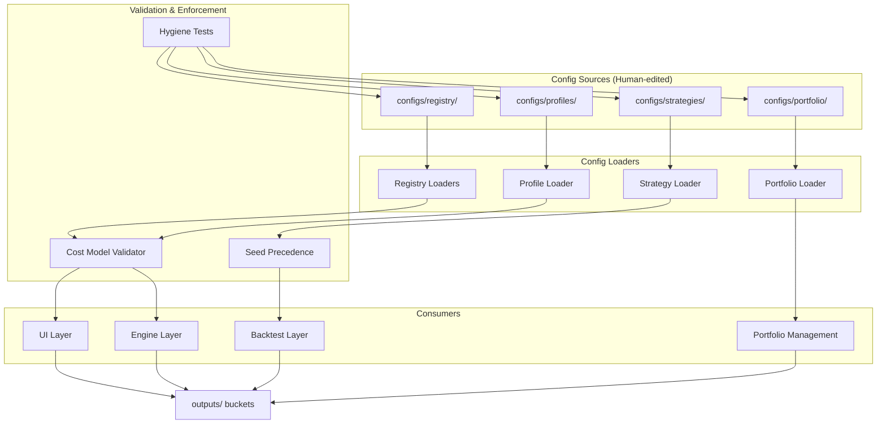
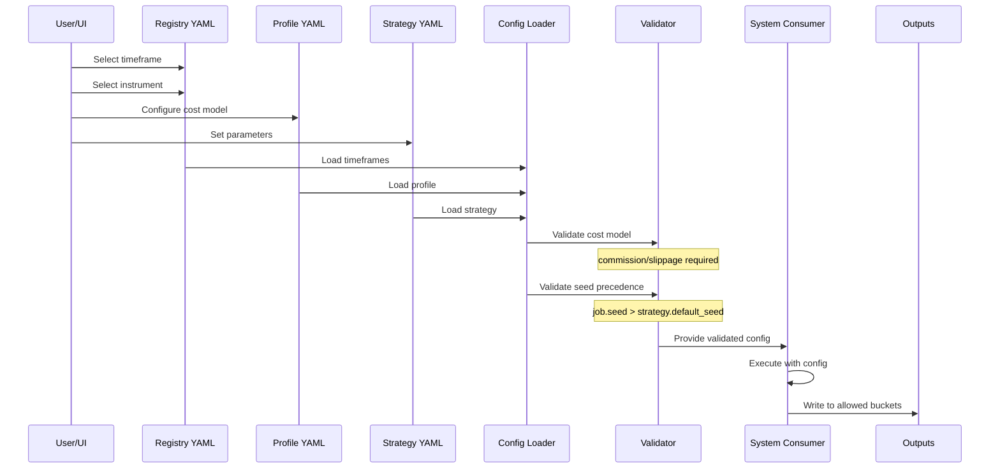
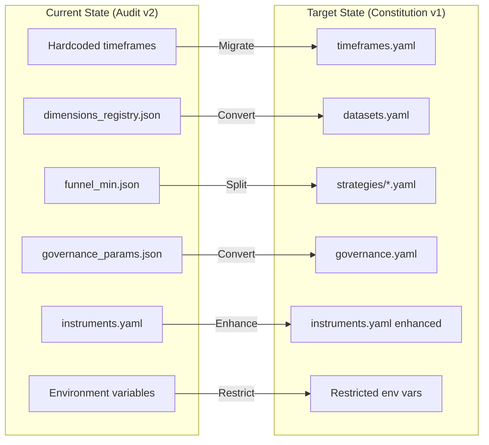
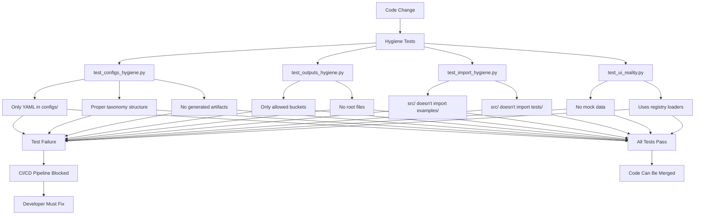

# Config Constitution v1 - Architecture Diagram

## System Architecture Overview



## Data Flow Diagram



## Configuration Taxonomy Hierarchy

```mermaid
graph TD
    Root[Config Constitution v1]
    
    Root --> Registry[Registry Layer]
    Root --> Profiles[Profile Layer]
    Root --> Strategies[Strategy Layer]
    Root --> Portfolio[Portfolio Layer]
    Root --> Constants[Code Constants]
    Root --> Environment[Environment]
    
    Registry --> Timeframes[timeframes.yaml]
    Registry --> Instruments[instruments.yaml]
    Registry --> Datasets[datasets.yaml]
    Registry --> StrategyCatalog[strategy_catalog.yaml]
    
    Profiles --> CME_MNQ[CME_MNQ.yaml]
    Profiles --> TWF_MXF[TWF_MXF.yaml]
    Profiles --> CostModel[cost_model section]
    Profiles --> Session[session specs]
    Profiles --> Memory[memory limits]
    
    Strategies --> S1[s1_v1.yaml]
    Strategies --> S2[s2_v1.yaml]
    Strategies --> S3[s3_v1.yaml]
    Strategies --> Determinism[determinism section]
    Strategies --> Parameters[parameters section]
    
    Portfolio --> Governance[governance.yaml]
    Portfolio --> Allocation[allocation.yaml]
    
    Constants --> DataAlignment[Data alignment algorithms]
    Constants --> PathTemplates[Path templates]
    Constants --> ExecutionSemantics[Execution semantics]
    
    Environment --> OutputsRoot[FISHBRO_OUTPUTS_ROOT]
    Environment --> SystemFlags[System-level flags only]
```



## Migration Path from Current State



## Enforcement Mechanism



## Key Architectural Decisions

### 1. Centralized vs Distributed Loaders
**Decision**: Centralized loader infrastructure in `src/config/` with specialized submodules
**Rationale**: Single source of truth for config loading patterns, consistent validation

### 2. Validation Timing
**Decision**: Validate at load time, not at runtime
**Rationale**: Fail fast principle - catch configuration errors early

### 3. Caching Strategy
**Decision**: Use `lru_cache` for registry loads
**Rationale**: Registry data changes infrequently, improves performance

### 4. Backward Compatibility
**Decision**: Phase migration with deprecation warnings
**Rationale**: Minimize disruption to existing workflows

### 5. Error Handling
**Decision**: Explicit error states in UI, no silent fallbacks
**Rationale**: Better user experience, easier debugging

## Component Responsibilities

### Registry Loaders (`src/config/registry/`)
- Load and validate YAML files from `configs/registry/`
- Provide typed access to registry data
- Cache results for performance

### Profile Loader (`src/config/profiles.py`)
- Load profile YAML with mandatory cost model validation
- Merge instrument specs with session configurations
- Provide memory limit defaults

### Strategy Loader (`src/config/strategies.py`)
- Load strategy definitions with parameter schemas
- Implement seed precedence: job > strategy default
- Block environment-based overrides

### Portfolio Loader (`src/config/portfolio.py`)
- Load governance and allocation rules
- Convert legacy JSON to YAML format
- Validate correlation thresholds

### Hygiene Tests (`tests/hygiene/`)
- Enforce configs/ directory structure
- Enforce outputs/ bucket structure
- Block illegal imports
- Validate UI reality principle

## Data Contracts

### Timeframe Registry Contract
```yaml
version: "1.0"  # Required
allowed_timeframes: [15, 30, 60, 120, 240]  # Required, list of ints
default: 60  # Required, must be in allowed_timeframes
```

### Profile Contract
```yaml
version: "2.0"  # Required
symbol: "CME.MNQ"  # Required
cost_model:  # Required section
  commission_per_side_usd: 0.0  # Required, float
  slippage_per_side_usd: 0.0    # Required, float
session:  # Optional
  exchange_tz: "America/Chicago"
  data_tz: "Asia/Taipei"
memory:  # Optional
  default_limit_mb: 2048
  allow_auto_downsample: true
```

### Strategy Contract
```yaml
version: "1.0"
strategy_id: "s1_v1"
determinism:  # Required
  default_seed: 42  # Required, int
parameters:  # Required
  fast_period: 
    type: "int"
    min: 5
    max: 20
    default: 8
features:  # Optional
  - name: "sma_20"
    timeframe: 60
```

## Performance Considerations

1. **Registry Caching**: Use `@lru_cache(maxsize=1)` on loader functions
2. **Lazy Loading**: Load configs only when needed
3. **Validation Overhead**: Pre-compile Pydantic models
4. **Memory Usage**: Clear caches on config changes

## Security Considerations

1. **YAML Safety**: Use `yaml.safe_load()` only
2. **Path Validation**: Validate all file paths to prevent directory traversal
3. **Environment Variables**: Restrict to system-level only
4. **Seed Security**: Don't expose seed generation logic

This architecture provides a robust foundation for Config Constitution v1 implementation.